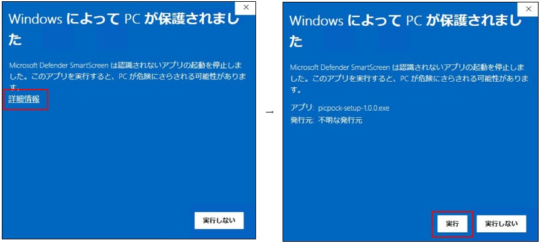
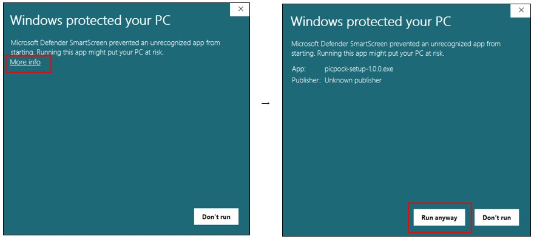

# PicPock (Picture in your pocket)
[日本語](#japanese) | [English](#english) 

## Website 
- (日本語)　　https://picpock.net
- (English)　　https://picpock.net/en

## Download
[Download PicPock](https://github.com/s-uzumaki/PicPock-App/releases/latest)

## ＜日本語＞

### PicPockとは
PicPock（ピックポック）は、あなただけのお気に入りのピクチャーディクショナリー（絵辞典）が作れる、どなたでも無料でご利用いただけるフリーソフトウェアです。

--- 

### 動作環境
- 本アプリはオフラインで動作可能です。インターネット接続は不要です。
- データは、設定画面で指定したフォルダー内に保存されます。
- 複数デバイス間でデータを同期したい場合は、クラウド同期フォルダー（Dropbox、OneDrive など）をご利用ください。

--- 

### 対応OS
- **Windows**: Windows 10 / 11 (64bit)
- **macOS**: macOS 14 Sonoma 以降

※ Windows 11 および macOS Sonoma (Intel) 環境にて動作確認済みです。

---

### インストール
#### ＜Windows の場合＞
1. インストーラーをダウンロードして実行してください。(picpock-setup-X.X.X.exe)

2. 本アプリは個人開発のためデジタル署名を行っておらず、インストール時にWindows SmartScreenの警告が表示されることがあります。以下の手順で回避が可能です。

  - 青い画面が表示されたら 「詳細情報」 をクリックします。

  - 右下に表示される 「実行」 ボタンをクリックすると、インストールが開始されます。

#### ＜Mac の場合＞
1. インストーラーをダウンロードして実行してください。(PicPock-X.X.X-x64.dmg)

2. 本アプリは個人開発のためデジタル署名を行っておらず、インストール時に「開発元を検証できません」という警告が表示されます。
以下の手順で回避が可能です。

- Finderでアプリのアイコンを右クリック（または Control を押しながらクリック）し、「開く」を選択します。

- 「開発元を検証できません」という警告が出ますが、そのまま「開く」をクリックします。

---

### アンインストール
- Windows、Mac ともにOS標準のアプリの削除画面からアンインストールを実行してください。

---

### 免責事項

本アプリは現状有姿（"as is"）で提供されます。
開発者は以下について一切の責任を負いません。

- 本アプリの使用・使用不能によって生じた損害
- データの消失・破損・文字化け等
- OS・ハードウェアの変更による動作不具合
- 第三者によるアクセスや情報漏えい

バックアップは利用者ご自身で行ってください。

---

## ＜English＞

### What is PicPock?
PicPock is free software that allows anyone to create their own personalized picture dictionary.

---

### Key Features & Environment
- Offline Capability: This application works entirely offline. No internet connection is required.

- Data Storage: Data is stored within a folder specified in the settings screen.

- Cloud Sync: To sync data across multiple devices, please use a cloud-integrated folder (such as Dropbox or OneDrive).

--- 

### Supported OS
- **Windows**: Windows 10 / 11 (64-bit)
- **macOS**: macOS 14 Sonoma or later

Operation has been verified on Windows 11 and macOS Sonoma (Intel).

--- 

### Installation
#### ＜Windows＞
1. Download and run the installer (picpock-setup-X.X.X.exe).

2. As this is an independently developed app without a digital signature, a Windows SmartScreen warning may appear. You can proceed by following these steps:

- Click "More info" on the blue warning screen.

- Click the "Run anyway" button that appears at the bottom right to start the installation.

#### ＜Mac＞
1. Download and open the installer (PicPock-X.X.X-x64.dmg).

2. Since this app is not digitally signed, a warning stating "App cannot be opened because the developer cannot be verified" will appear. You can proceed with these steps:

- Right-click (or Control-click) the app icon in Finder and select "Open".
- When the warning appears, click "Open" again to launch the app.

---

### Uninstallation
Use the standard OS application removal process for both Windows and macOS.

---

### Disclaimer

This application is provided "as is" without warranty of any kind.
The developer assumes no responsibility for:

- Any damages arising from the use or inability to use this application
- Loss, corruption, or garbling of data
- Malfunctions caused by OS or hardware changes
- Unauthorized access or information leakage by third parties

Please make sure to back up your data regularly.
